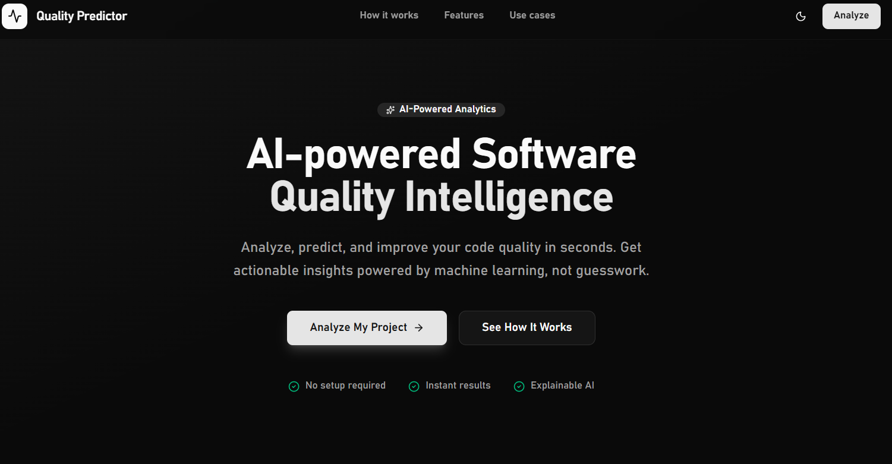
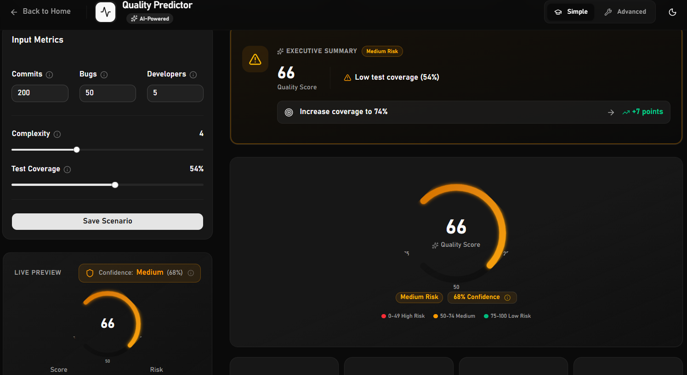
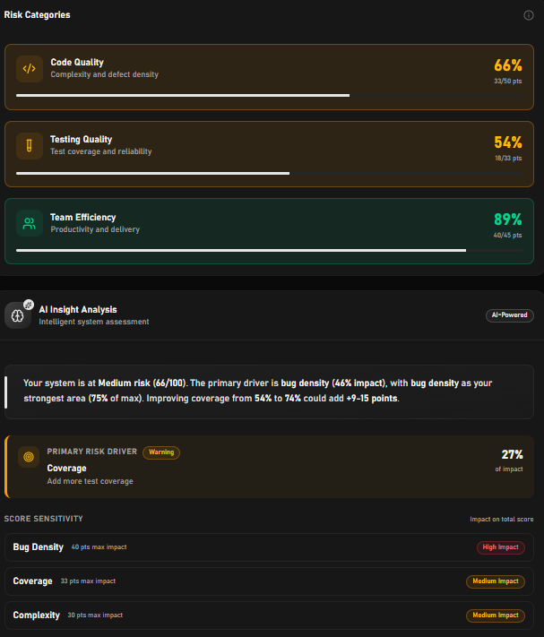

# Qualioro

AI-powered software quality intelligence — from metrics to actionable insight in seconds.

Qualioro helps you understand your code quality in seconds — not just with a score, but with clear, explainable insights on what’s actually going wrong and what to fix next.

[Live Demo](https://qualioro.vercel.app/)

---
## Product Preview

<details>
<summary>View Screenshots</summary>

<br/>

### Landing


### Input & Analysis


### Insights & Risk Breakdown


</details>

---

## Why it exists

Most teams don’t lack effort — they lack visibility.


Codebases grow, deadlines shrink, and quality becomes something you “feel” instead of measure. That’s where problems start: hidden bugs, rising complexity, unstable releases.

Qualioro turns that ambiguity into something concrete:
- A clear quality score
- A visible risk level
- A breakdown of what’s actually driving issues

---

## Design philosophy

Qualioro is built around one idea: clarity over complexity.

Instead of overwhelming teams with metrics, it focuses on a small set of signals that actually drive quality — and turns them into clear, actionable insights.

---

## Core capabilities

| Capability | Description |
|-----------|------------|
| Quality scoring | Generates a 0–100 score with a clear risk classification |
| Explainable analysis | Shows how each metric contributes to the final result |
| What-if simulation | Adjust inputs and instantly see how the score changes |
| Targeted recommendations | Suggests actions based on weakest areas |
| Visual breakdowns | Makes trends and trade-offs easy to understand |
| Export options | Share results or download them when needed |

---

## How it works

The system evaluates a small set of meaningful signals:

| Factor | What it reflects |
|--------|------------------|
| Bug density | Reliability and defect rate |
| Complexity | Maintainability of the code |
| Test coverage | Confidence in changes |
| Team output | Development activity balance |

From that, it produces:
- A quality score
- A risk level (low / medium / high)
- A confidence indicator
- Actionable recommendations

Advanced mode exposes the full scoring breakdown for transparency.

---

## Architecture (simplified)

Input Metrics → Scoring Engine → Insight Layer → Interactive UI

Everything runs client-side. No data is sent or stored externally.

---

## Tech stack

- Next.js 15 (App Router)
- TypeScript
- Tailwind CSS
- shadcn/ui
- Recharts

---

## Project structure

app/           → Routing and pages  
components/    → UI building blocks  
lib/           → Scoring logic and utilities  
public/        → Static assets  
screenshots/   → Product previews  

---

## Getting started
```bash
git clone https://github.com/Fadydesoky/Qualioro.git
npm install
npm run dev
```
Then open: http://localhost:3000

---

## Use cases

- Pre-release quality checks  
- Prioritizing technical debt  
- Supporting code reviews with data  
- Monitoring engineering health  
- Making better sprint decisions  

---

## Limitations

This version uses a simplified scoring model and simulated inputs.
Future iterations will integrate real repository data and CI/CD pipelines.

---

## Roadmap

- GitHub / GitLab integrations  
- CI/CD data ingestion  
- Team-level dashboards  
- Historical tracking and alerts  
- Public API  

---

## Author

Fady Desoky  
https://github.com/Fadydesoky

---

<p align="center">
  <strong>Ship with clarity.</strong>
</p>
